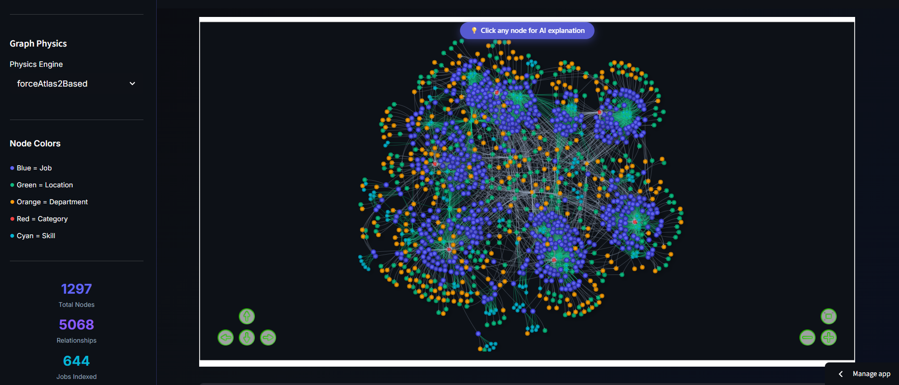
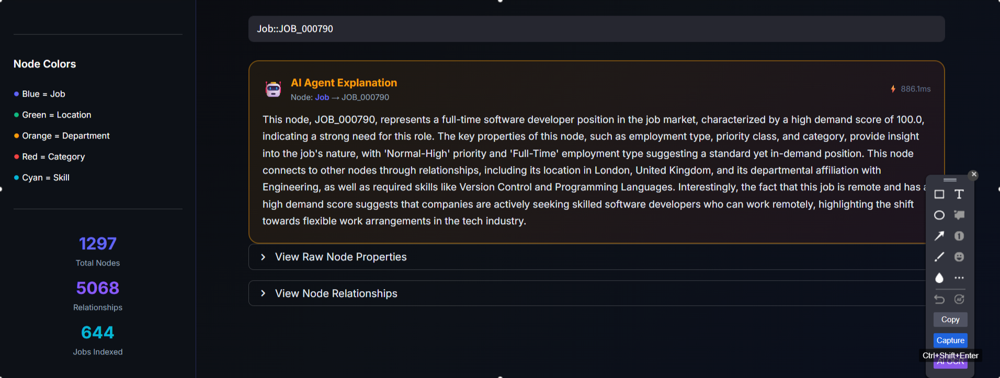
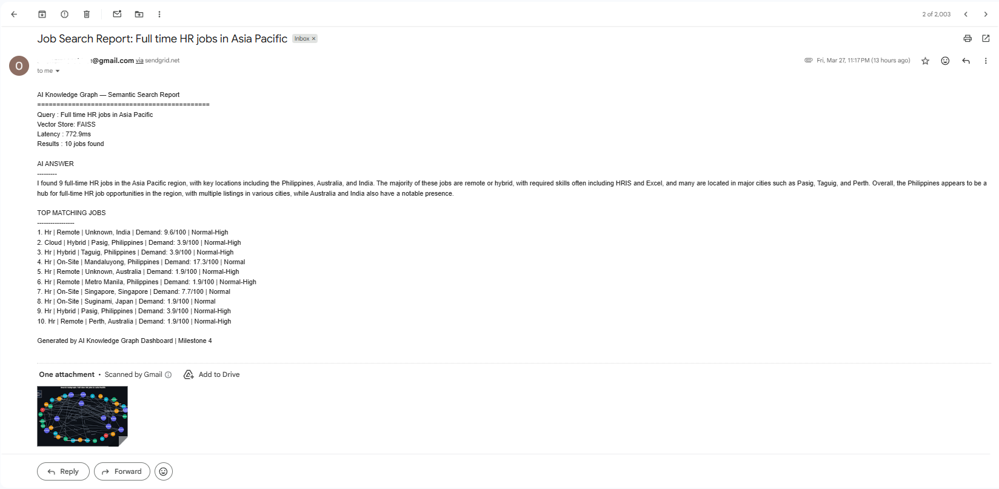

# 🧠 AI Knowledge Graph Builder for Enterprise Intelligence

[](https://python.org)
[](https://neo4j.com)
[](https://langchain.com)
[](https://groq.com)
[](https://streamlit.io)
[](https://sendgrid.com)
[](LICENSE)
[](https://aiknowledgegraphbuilderforenterpriseinteligence.streamlit.app/)

> An AI-powered platform that automatically builds dynamic knowledge graphs from enterprise job data, enabling intelligent semantic search, RAG-powered Q&A, interactive graph visualization, and automated email reporting.

---

## 🌐 Live Demo

🚀 **[Click here to explore the live app →](https://aiknowledgegraphbuilderforenterpriseinteligence.streamlit.app/)**

---

## 📸 Dashboard Preview








---

## 📋 Table of Contents

- [Project Overview](#-project-overview)
- [Project Architecture](#-project-architecture)
- [Tech Stack](#-tech-stack)
- [Milestones](#-milestones)
- [Email Reporting Feature](#-email-reporting-feature)
- [Dataset](#-dataset)
- [Setup & Installation](#-setup--installation)
- [Results](#-results)
- [Project Structure](#-project-structure)
- [Team](#-team)

---

## 🎯 Project Overview

This project builds an end-to-end AI-powered Knowledge Graph system for enterprise job intelligence. It processes real-world job postings data, constructs a richly connected Neo4j Knowledge Graph, enables intelligent semantic search using RAG pipelines, and delivers an interactive dashboard for graph exploration and insight discovery — with built-in email reporting to share AI insights instantly.

**Key Capabilities:**
- Automated entity and relationship extraction from job data
- LLM-based Named Entity Recognition for skill extraction
- RAG-powered natural language search over 644 job records
- Interactive graph visualization with 1298 nodes and 5243 relationships
- Real-time semantic Q&A using Groq Llama 3
- Node AI Agent — click any graph node for instant AI explanation
- 📧 Email Reporting — share node insights and search results with subgraph images via SendGrid

---

## 🏗️ Project Architecture

```
Raw Job Data (CSV)
        ↓
┌─────────────────────────────┐
│   Milestone 1               │
│   Data Ingestion &          │
│   Preprocessing             │
│   644 rows × 25 columns     │
└────────────┬────────────────┘
             ↓
┌─────────────────────────────┐
│   Milestone 2               │
│   Knowledge Graph           │
│   Neo4j: 1298 nodes         │
│   5243 relationships        │
│   LLM NER: 125 skills       │
└────────────┬────────────────┘
             ↓
┌─────────────────────────────┐
│   Milestone 3               │
│   RAG + Semantic Search     │
│   LangChain + FAISS         │
│   vs Pinecone Evaluation    │
│   FAISS wins 8/8 queries    │
└────────────┬────────────────┘
             ↓
┌─────────────────────────────┐
│   Milestone 4               │
│   Interactive Dashboard     │
│   Streamlit + PyVis         │
│   Node AI Agent             │
│   Plotly Visualizations     │
│   📧 Email Reporting        │
└─────────────────────────────┘
```

---

## 🛠️ Tech Stack

| Component | Tool | Purpose |
|---|---|---|
| **Graph Database** | Neo4j Aura | Store and query knowledge graph |
| **LLM** | Groq Llama 3.3-70B | NER + RAG answer generation |
| **RAG Framework** | LangChain | Pipeline orchestration |
| **Vector Store** | FAISS | Local semantic search (~36ms) |
| **Cloud Vector Store** | Pinecone | Cloud semantic search (~674ms) |
| **Embeddings** | all-MiniLM-L6-v2 | Text to 384-dim vectors |
| **Dashboard** | Streamlit | Interactive web UI |
| **Graph Viz** | PyVis + Plotly | Interactive graph visualization |
| **Subgraph Images** | NetworkX + Matplotlib | Static PNG generation for email reports |
| **Email Delivery** | SendGrid | Email report delivery with PNG attachments |
| **Deployment** | Streamlit Cloud | Live public deployment |
| **Total Cost** | **$0.00** | All free tools |

---

## 📅 Milestones

### Milestone 1 — Data Ingestion & Schema Design
**Objective:** Connect to enterprise data sources and build ingestion pipeline.

**Tasks Completed:**
- Loaded raw job postings dataset with 644 records
- Handled missing values and removed duplicates
- Normalized categorical columns (workplace, employment type)
- Standardized location data across 62 countries and 232 cities
- Feature engineering — demand score and priority class columns
- Data enrichment — department category classification
- Exported `processed_data_milestone1.csv` (644 rows × 25 columns)

**Output:** Clean, structured dataset ready for graph construction.

---

### Milestone 2 — Entity Extraction & Graph Building
**Objective:** Extract entities and relationships, construct Neo4j Knowledge Graph.

**Tasks Completed:**
- Defined 5 entity types: Job, Location, Department, Category, Skill
- Extracted 4 relationship types: LOCATED_IN, IN_DEPARTMENT, BELONGS_TO, REQUIRES
- Built NetworkX in-memory graph for quick analysis
- Constructed Neo4j Knowledge Graph using Cypher queries
- Implemented LLM-based NER using Groq Llama 3 to extract 125 unique skills
- Optimized API calls from 644 to 35 unique combinations (94% reduction)

**Graph Statistics:**
```
Nodes:         1298 total
  ├── Job:          644
  ├── Location:     257
  ├── Department:   266
  ├── Category:       6
  └── Skill:        125

Relationships: 5243 total
  ├── LOCATED_IN:    644
  ├── IN_DEPARTMENT: 644
  ├── BELONGS_TO:    644
  └── REQUIRES:     3311
```

---

### Milestone 3 — Semantic Search & RAG Pipelines
**Objective:** Enable intelligent natural language search and retrieval.

**Tasks Completed:**
- Loaded 644 jobs from Neo4j with skills via REQUIRES relationships
- Converted jobs to LangChain Documents with rich text descriptions
- Built FAISS vector store with MMR retriever (fetch 30 → best 10)
- Built Pinecone cloud vector store for comparison
- Ran head-to-head evaluation across 8 test queries
- FAISS won 8/8 queries — 18.7x faster than Pinecone at this scale
- Average retrieval latency: FAISS 36ms vs Pinecone 674ms

**RAG Pipeline:**
```
User Query
    ↓
HuggingFace Embeddings (all-MiniLM-L6-v2)
    ↓
FAISS MMR Search (top 10 diverse results)
    ↓
LangChain Prompt Template (context + question)
    ↓
Groq Llama 3.3-70B
    ↓
Natural Language Answer
```

---

### Milestone 4 — Dashboard & Deployment
**Objective:** Build interactive graph visualization dashboard and deploy.

**Tasks Completed:**
- Built 6-tab Streamlit dashboard with dark glassmorphism theme
- Tab 1 — Graph Explorer: PyVis animated knowledge graph (1298 nodes, 4 physics engines)
- Tab 2 — Analytics: Plotly charts for node/relationship distribution and top skills
- Tab 3 — Semantic Search: RAG chat interface with FAISS and Pinecone toggle
- Tab 4 — FAISS vs Pinecone: Visual comparison with latency gauges and results table
- Tab 5 — Job Explorer: Filterable table with demand score histogram
- Tab 6 — Global Insights: World map, treemap, sunburst chart, priority heatmap
- Node AI Agent: Click any graph node → instant Groq LLM explanation
- 📧 Email Reporting: Share node insights and search results with subgraph PNGs via SendGrid
- Deployed via Streamlit Cloud with permanent public URL

---

## 📧 Email Reporting Feature

A communication channel built using **SendGrid** that lets users share AI-generated insights directly from the dashboard. Two reporting scenarios are supported:

### Scenario 1 — Node Click Report
1. Click any node in the graph (e.g. a Skill node like **"Python"**)
2. The Node AI Agent generates an instant explanation using Groq LLM
3. Hit **"Share as Email Report"**
4. The email is sent with:
   - ✅ The full AI explanation text
   - ✅ A static subgraph PNG showing Python → connected jobs, departments, categories
   - ✅ The node's properties table

```
User clicks "Python" node
        ↓
Node AI Agent (Groq LLM) explains it
        ↓
NetworkX + Matplotlib generates subgraph PNG
        ↓
SendGrid sends email with PNG attachment
        ↓
Recipient receives full report 📩
```

### Scenario 2 — Search Result Report
1. Search for e.g. **"Remote Data Scientist jobs in India"**
2. Get 10 RAG-matched job results
3. Hit **"Share as Email Report"**
4. The email is sent with:
   - ✅ The RAG-generated AI answer
   - ✅ Top 10 job cards as a formatted table
   - ✅ A static subgraph PNG showing those job nodes and their connections

```
User searches "Remote Data Scientist jobs in India"
        ↓
FAISS / Pinecone retrieves top 10 matching jobs
        ↓
Groq LLM generates RAG answer
        ↓
NetworkX + Matplotlib builds result subgraph PNG
        ↓
SendGrid sends email with report + PNG attachment
        ↓
Recipient receives full report 📩
```

### Email Setup (SendGrid)
Add these to your `.streamlit/secrets.toml`:
```toml
SENDGRID_API_KEY = "SG.your_sendgrid_api_key"
SENDER_EMAIL     = "verified_sender@yourdomain.com"
```
> **Note:** The sender email must be verified in your SendGrid account. A free SendGrid account supports up to 100 emails/day.

---

## 📊 Dataset

| Property | Value |
|---|---|
| Source | Real-world job postings |
| Records | 644 jobs |
| Columns | 25 (original) → 27 (with skills) |
| Categories | Business Analyst, Data Scientist, Cloud, HR, Software Developer, UI/UX |
| Locations | 62 countries, 232 cities, 5 regions |
| Skills Extracted | 125 unique skills via LLM NER |
| Top Skills | SQL (214), Python (159), Excel (138), AWS (107), Azure (107) |

---

## ⚙️ Setup & Installation

### Prerequisites
- Neo4j Aura account (free) — [console.neo4j.io](https://console.neo4j.io)
- Groq API key (free) — [console.groq.com](https://console.groq.com)
- Pinecone account (free) — [app.pinecone.io](https://app.pinecone.io)
- SendGrid account (free) — [sendgrid.com](https://sendgrid.com)

### Step 1 — Clone Repository
```bash
git clone https://github.com/SukumarDivi/AI_Knowledge_Graph_Builder_For_Enterprise_Inteligence.git
```

### Step 2 — Install Dependencies
```bash
pip install streamlit pyvis plotly neo4j langchain langchain-groq langchain-community
pip install langchain-pinecone sentence-transformers faiss-cpu pinecone pandas
pip install sendgrid networkx matplotlib
```

### Step 3 — Configure Secrets
Create `.streamlit/secrets.toml`:
```toml
NEO4J_URI        = "neo4j+s://your-instance.databases.neo4j.io"
NEO4J_USER       = "neo4j"
NEO4J_PASSWORD   = "your-password"
GROQ_API_KEY     = "gsk_your-key"
PINECONE_API_KEY = "your_pinecone_key"
PINECONE_INDEX   = "job-knowledge-graph-rag"
NGROK_TOKEN      = "your_ngrok_token"
SENDGRID_API_KEY = "SG.your_sendgrid_key"
SENDER_EMAIL     = "verified_sender@yourdomain.com"
```

### Step 4 — Run Dashboard
```bash
streamlit run app.py
```

---

## 📈 Results

### Knowledge Graph
| Metric | Value |
|---|---|
| Total Nodes | 1298 |
| Total Relationships | 5243 |
| Unique Skills Extracted | 125 |
| API Calls Optimized | 644 → 35 (94% reduction) |

### RAG Performance
| Metric | FAISS | Pinecone |
|---|---|---|
| Avg Retrieval Latency | 36ms | 674ms |
| Head-to-Head Wins | 8/8 | 0/8 |
| Answer Quality | Grounded, no hallucinations | Same |
| Cost | $0.00 | $0.00 |
| Speed Advantage | **18.7x faster** | — |

### Top 5 Skills Extracted by LLM NER
| Skill | Jobs Requiring |
|---|---|
| SQL | 214 |
| Python | 159 |
| Excel | 138 |
| AWS | 107 |
| Azure | 107 |

---

## 📁 Project Structure

```
AI_Knowledge_Graph_Builder_For_Enterprise_Inteligence/
│
├── notebooks/
│   ├── MileStone_1_JOB_POSTINGS.ipynb              # Data preprocessing
│   ├── Milestone_2_final.ipynb                      # Knowledge graph construction
│   ├── Milestone_3_LangChain_Groq.ipynb             # FAISS RAG pipeline
│   ├── Milestone_3_LangChain_Pinecone.ipynb         # Pinecone RAG pipeline
│   └── Milestone_4_Dashboard.ipynb                  # Dashboard notebook
│
├── data/
│   ├── raw/
│   │   └── Job_Postings_dataset.csv                 # Original dataset
│   └── processed/
│       ├── processed_data_milestone1.csv            # Cleaned dataset (644 × 25)
│       └── processed_data_with_skills.csv           # With skills column (644 × 27)
│
├── Outputs/
│   ├── milestone2_entities.csv                      # Extracted entities
│   ├── milestone2_relationships.csv                 # Extracted relationships
│   ├── milestone2_metrics.txt                       # Graph statistics
│   └── knowledge_graph_sample.png                  # Graph visualization
│
├── assests/
│   ├── image1.png                                   # Dashboard overview screenshot
│   ├── image2.png                                   # Knowledge graph screenshot
│   └── image3.png                                   # RAG search screenshot
│
├── app.py                                           # Streamlit dashboard (6 tabs)
├── graph_utils.py                                   # Neo4j data loading utilities
├── search_utils.py                                  # LangChain RAG pipelines + email
├── styles.css                                       # Dark glassmorphism theme
├── requirements.txt                                 # Python dependencies
└── README.md
```

---

## 👥 Team

| Name | Role |
|---|---|
| Sukumar Divi | Data Engineering, Knowledge Graph, RAG Pipeline, Dashboard |
| Anushree Vanam | Data Engineering, Knowledge Graph, RAG Pipeline, Email Reporting |

**Mentor:** Apeksha Rahangdale — Infosys Springboard AI Internship Program

---

## 🏆 Key Achievements

- ✅ Built end-to-end AI Knowledge Graph pipeline — Milestone 1 to 4
- ✅ Extracted 125 unique skills using LLM-based NER (Groq Llama 3)
- ✅ Optimized API calls from 644 to 35 — saving 94% tokens
- ✅ Built RAG system 18.7x faster than Pinecone using FAISS
- ✅ Interactive dashboard with 6 tabs, node AI agent, live semantic search
- ✅ Email reporting via SendGrid — node insights + search results with subgraph PNGs
- ✅ Total project cost: **$0.00** — all free tools

---

## 📄 License

This project is licensed under the MIT License — see the [LICENSE](LICENSE) file for details.

---

## 🙏 Acknowledgements

- [Infosys Springboard](https://infosysspringboard.com) — Project mentorship
- [Neo4j](https://neo4j.com) — Free Aura cloud graph database
- [Groq](https://groq.com) — Free Llama 3 API
- [LangChain](https://langchain.com) — RAG framework
- [Meta FAISS](https://github.com/facebookresearch/faiss) — Vector search library
- [Streamlit](https://streamlit.io) — Dashboard framework
- [SendGrid](https://sendgrid.com) — Email delivery API

---

*Built with ❤️ for the Infosys Springboard AI Internship Program*