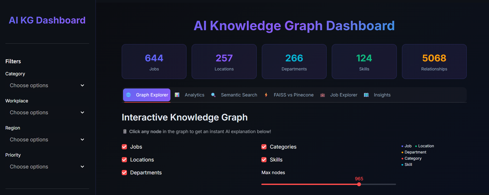

# 🧠 AI Knowledge Graph Builder for Enterprise Intelligence

[](https://python.org)
[](https://neo4j.com)
[](https://langchain.com)
[](https://groq.com)
[](https://streamlit.io)
[](LICENSE)
[](https://aiknowledgegraphbuilderforenterpriseinteligence.streamlit.app/)

> An AI-powered platform that automatically builds dynamic knowledge graphs from enterprise job data, enabling intelligent semantic search, RAG-powered Q&A, and interactive graph visualization.

---

## 🌐 Live Demo

🚀 **[Click here to explore the live app →](https://aiknowledgegraphbuilderforenterpriseinteligence.streamlit.app/)**

---

## 📸 Dashboard Preview




---

## 📋 Table of Contents

- [Project Overview](#-project-overview)
- [Project Architecture](#-project-architecture)
- [Tech Stack](#-tech-stack)
- [Milestones](#-milestones)
- [Dataset](#-dataset)
- [Setup & Installation](#-setup--installation)
- [How to Run](#-how-to-run)
- [Results](#-results)
- [Project Structure](#-project-structure)
- [Team](#-team)

---

## 🎯 Project Overview

This project builds an end-to-end AI-powered Knowledge Graph system for enterprise job intelligence. It processes real-world job postings data, constructs a richly connected Neo4j Knowledge Graph, enables intelligent semantic search using RAG pipelines, and delivers an interactive dashboard for graph exploration and insight discovery.

**Key Capabilities:**
- Automated entity and relationship extraction from job data
- LLM-based Named Entity Recognition for skill extraction
- RAG-powered natural language search over 644 job records
- Interactive graph visualization with 1298 nodes and 5243 relationships
- Real-time semantic Q&A using Groq Llama 3

---

## 🏗️ Project Architecture

```
Raw Job Data (CSV)
        ↓
┌─────────────────────────────┐
│   Milestone 1               │
│   Data Ingestion &          │
│   Preprocessing             │
│   644 rows × 25 columns     │
└────────────┬────────────────┘
             ↓
┌─────────────────────────────┐
│   Milestone 2               │
│   Knowledge Graph           │
│   Neo4j: 1298 nodes         │
│   5243 relationships        │
│   LLM NER: 125 skills       │
└────────────┬────────────────┘
             ↓
┌─────────────────────────────┐
│   Milestone 3               │
│   RAG + Semantic Search     │
│   LangChain + FAISS         │
│   Groq Llama 3              │
└────────────┬────────────────┘
             ↓
┌─────────────────────────────┐
│   Milestone 4               │
│   Interactive Dashboard     │
│   Streamlit + PyVis         │
│   Plotly Visualizations     │
└─────────────────────────────┘
```

---

## 🛠️ Tech Stack

| Component | Tool | Purpose |
|---|---|---|
| **Graph Database** | Neo4j Aura | Store and query knowledge graph |
| **LLM** | Groq Llama 3.3-70B | NER + RAG answer generation |
| **RAG Framework** | LangChain | Pipeline orchestration |
| **Vector Store** | FAISS | Local semantic search (~36ms) |
| **Embeddings** | all-MiniLM-L6-v2 | Text to 384-dim vectors |
| **Dashboard** | Streamlit | Interactive web UI |
| **Graph Viz** | PyVis + Plotly | Interactive graph visualization |
| **Deployment** | Streamlit Cloud | Live public deployment |
| **Environment** | Google Colab | Cloud notebook execution |
| **Total Cost** | **$0.00** | All free tools |

---

## 📅 Milestones

### Milestone 1 — Data Ingestion & Schema Design
**Objective:** Connect to enterprise data sources and build ingestion pipeline.

**Tasks Completed:**
- Loaded raw job postings dataset with 644 records
- Handled missing values and removed duplicates
- Normalized categorical columns (workplace, employment type)
- Standardized location data across 62 countries and 232 cities
- Feature engineering — demand score and priority class columns
- Data enrichment — department category classification
- Exported `processed_data_milestone1.csv` (644 rows × 25 columns)

**Output:** Clean, structured dataset ready for graph construction.

---

### Milestone 2 — Entity Extraction & Graph Building
**Objective:** Extract entities and relationships, construct Neo4j Knowledge Graph.

**Tasks Completed:**
- Defined 5 entity types: Job, Location, Department, Category, Skill
- Extracted 4 relationship types: LOCATED_IN, IN_DEPARTMENT, BELONGS_TO, REQUIRES
- Built NetworkX in-memory graph for quick analysis
- Constructed Neo4j Knowledge Graph using Cypher queries
- Implemented LLM-based NER using Groq Llama 3 to extract 125 unique skills
- Optimized API calls from 644 to 35 unique combinations

**Graph Statistics:**
```
Nodes:         1298 total
  ├── Job:          644
  ├── Location:     257
  ├── Department:   266
  ├── Category:       6
  └── Skill:        125

Relationships: 5243 total
  ├── LOCATED_IN:    644
  ├── IN_DEPARTMENT: 644
  ├── BELONGS_TO:    644
  └── REQUIRES:     3311
```

---

### Milestone 3 — Semantic Search & RAG Pipelines
**Objective:** Enable intelligent natural language search and retrieval.

**Tasks Completed:**
- Loaded 644 jobs from Neo4j with skills via REQUIRES relationships
- Converted jobs to LangChain Documents with rich text descriptions
- Built FAISS vector store with MMR retriever (fetch 30 → best 10)
- Implemented LangChain RAG chain with Groq Llama 3
- Tested and compared FAISS vs Pinecone (FAISS won 8/8 queries)
- Average retrieval latency: FAISS 36ms vs Pinecone 674ms (18.7x faster)

**RAG Pipeline:**
```
User Query
    ↓
HuggingFace Embeddings (all-MiniLM-L6-v2)
    ↓
FAISS MMR Search (top 10 diverse results)
    ↓
LangChain Prompt Template (context + question)
    ↓
Groq Llama 3.3-70B
    ↓
Natural Language Answer
```

---

### Milestone 4 — Dashboard & Deployment
**Objective:** Build interactive graph visualization dashboard and deploy.

**Tasks Completed:**
- Built 5-tab Streamlit dashboard with dark glassmorphism theme
- Tab 1: PyVis animated knowledge graph (all 1298 nodes, physics-based)
- Tab 2: Analytics — Plotly charts for node and relationship distribution
- Tab 3: RAG Semantic Search — chat interface powered by LangChain + Groq
- Tab 4: Job Explorer — filterable table with demand score distribution
- Tab 5: Global Insights — world map, treemap, sunburst, heatmap
- Deployed via Streamlit Cloud with permanent public URL

---

## 📊 Dataset

| Property | Value |
|---|---|
| Source | Real-world job postings |
| Records | 644 jobs |
| Columns | 25 (original) → 27 (with skills) |
| Categories | Business Analyst, Data Scientist, Cloud, HR, Software Developer, UI/UX |
| Locations | 62 countries, 232 cities, 5 regions |
| Skills Extracted | 125 unique skills via LLM NER |
| Top Skills | SQL (214), Python (159), Excel (138), AWS (107), Azure (107) |

---

## ⚙️ Setup & Installation

### Prerequisites
- Google Colab account (free)
- Neo4j Aura account (free) — [console.neo4j.io](https://console.neo4j.io)
- Groq API key (free) — [console.groq.com](https://console.groq.com)
- ngrok account (free) — [ngrok.com](https://ngrok.com)

### Step 1 — Clone Repository
```bash
git clone https://github.com/SukumarDivi/AI_Knowledge_Graph_Builder_For_Enterprise_Inteligence.git
```

### Step 2 — Open in Google Colab
Upload the notebook to Google Colab or open directly from GitHub.

### Step 3 — Update Credentials
In the configuration cell update:
```python
NEO4J_URI      = "neo4j+s://your-instance.databases.neo4j.io"
NEO4J_USER     = "neo4j"
NEO4J_PASSWORD = "your-password"
GROQ_API_KEY   = "gsk_your-key"
```

### Step 4 — Install Dependencies
```bash
# Milestone 1 & 2
pip install pandas networkx matplotlib seaborn neo4j groq

# Milestone 3
pip install langchain langchain-groq langchain-community langchain-core sentence-transformers faiss-cpu neo4j

# Milestone 4
pip install streamlit pyvis plotly pyngrok neo4j langchain langchain-groq langchain-community sentence-transformers faiss-cpu pandas
```

---

## 🚀 How to Run

### Milestone 1 — Data Preprocessing
```
1. Open MileStone_1_JOB_POSTINGS.ipynb in Google Colab
2. Upload Job_Postings_dataset.csv
3. Run all cells
4. Download processed_data_milestone1.csv
```

### Milestone 2 — Knowledge Graph
```
1. Open Milestone_2_final.ipynb in Google Colab
2. Upload processed_data_milestone1.csv
3. Update Neo4j and Groq credentials in Cell 7 (Section 1.3)
4. Run all cells
5. View graph at console.neo4j.io
```

### Milestone 3 — RAG Search
```
1. Open Milestone_3_LangChain_Groq.ipynb in Google Colab
2. Ensure Neo4j is running (resume at console.neo4j.io if paused)
3. Update credentials in Cell 7 (Section 1.3)
4. Run all cells
5. Test queries in Section 6
```

### Milestone 4 — Dashboard
```
1. Open Milestone_4_Dashboard.ipynb in Google Colab
2. Update credentials in Cell 5 (Section 1.2)
3. Update NGROK_TOKEN in Cell 17 (Section 3.1)
4. Run all cells in order
5. Open the public URL printed in Cell 19
```

---

## 📈 Results

### Knowledge Graph
| Metric | Value |
|---|---|
| Total Nodes | 1298 |
| Total Relationships | 5243 |
| Unique Skills Extracted | 125 |
| API Calls Optimized | 644 → 35 (94% reduction) |

### RAG Performance
| Metric | FAISS | Pinecone |
|---|---|---|
| Avg Retrieval Latency | 36ms | 674ms |
| Head-to-Head Wins | 8/8 | 0/8 |
| Answer Quality | Grounded, no hallucinations | Same |
| Cost | $0.00 | $0.00 |
| Speed Advantage | **18.7x faster** | — |

### Top 5 Skills Extracted by LLM NER
| Skill | Jobs Requiring |
|---|---|
| SQL | 214 |
| Python | 159 |
| Excel | 138 |
| AWS | 107 |
| Azure | 107 |

---

## 📁 Project Structure

```
ai-knowledge-graph-builder/
│
├── notebooks/
│   ├── MileStone_1_JOB_POSTINGS.ipynb       # Data preprocessing
│   ├── Milestone_2_final.ipynb               # Knowledge graph construction
│   ├── Milestone_3_LangChain_Groq.ipynb      # RAG semantic search
│   └── Milestone_4_Dashboard.ipynb           # Interactive dashboard
│
├── data/
│   ├── raw/
│   │   └── Job_Postings_dataset.csv          # Original dataset
│   └── processed/
│       ├── processed_data_milestone1.csv     # Cleaned dataset (644 × 25)
│       └── processed_data_with_skills.csv    # With skills column (644 × 27)
│
├── assets/
│   └── screenshots/
│       └── dashboard.png                     # Dashboard preview screenshot
│
├── outputs/
│   ├── milestone2_entities.csv               # Extracted entities
│   ├── milestone2_relationships.csv          # Extracted relationships
│   ├── milestone2_metrics.txt                # Graph statistics
│   ├── knowledge_graph_sample.png            # Graph visualization
│   ├── faiss_index_langchain/                # Saved FAISS index
│   └── job_metadata.json                     # Job metadata for RAG
│
├── app.py                                # Streamlit dashboard
├── graph_utils.py                        # Neo4j data loading
├── search_utils.py                       # LangChain RAG search
└── styles.css                            # Dark theme CSS
│
└── README.md
```

---

## 👥 Team

| Names |
|---|
| Sukumar Divi, Vanam Anushree |

**Mentor:** Infosys Springboard Program

---

## 🏆 Key Achievements

- ✅ Built end-to-end AI Knowledge Graph pipeline — Milestone 1 to 4
- ✅ Extracted 125 unique skills using LLM-based NER (Groq Llama 3)
- ✅ Optimized API calls from 644 to 35 — saving 94% tokens
- ✅ Built RAG system 18.7x faster than Pinecone using FAISS
- ✅ Deployed interactive dashboard with 5 tabs and live semantic search
- ✅ Total project cost: **$0.00** — all free tools

---

## 📄 License

This project is licensed under the MIT License — see the [LICENSE](LICENSE) file for details.

---

## 🙏 Acknowledgements

- [Infosys Springboard](https://infosysspringboard.com) — Project mentorship
- [Neo4j](https://neo4j.com) — Free Aura cloud graph database
- [Groq](https://groq.com) — Free Llama 3 API
- [LangChain](https://langchain.com) — RAG framework
- [Meta FAISS](https://github.com/facebookresearch/faiss) — Vector search library
- [Streamlit](https://streamlit.io) — Dashboard framework

---

*Built with ❤️ for the Infosys Springboard AI Internship Program*